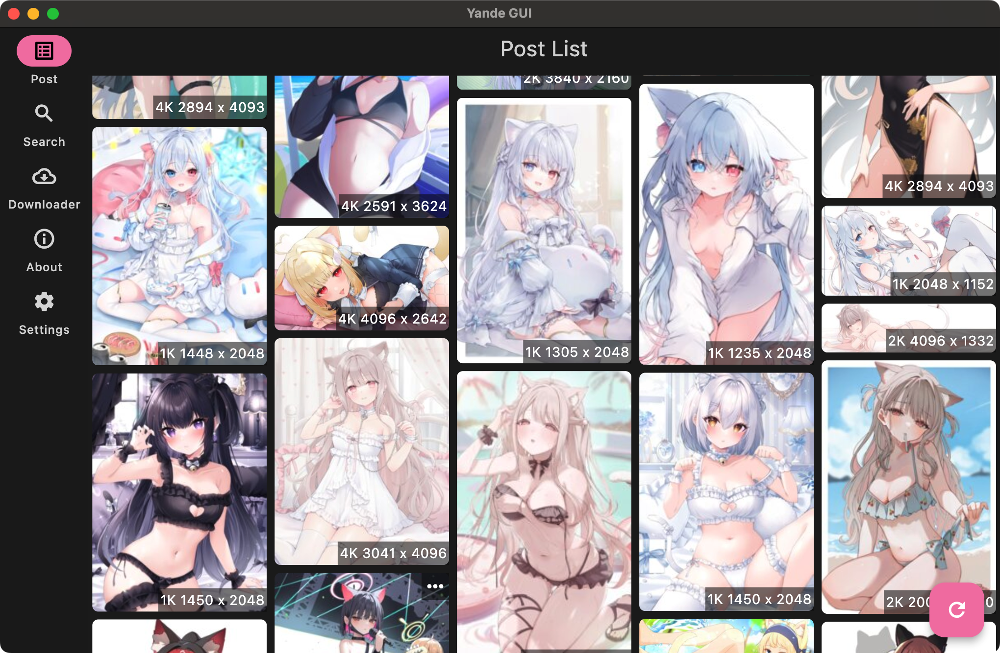
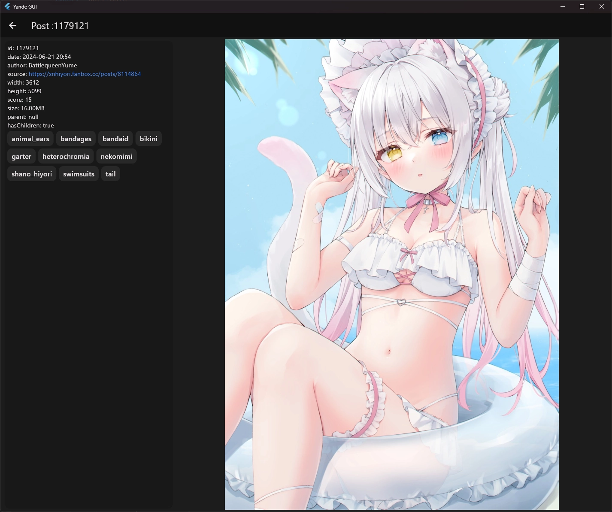

# Yande GUI

**A cross-platform graphical user interface for [yande.re](https://yande.re/)**

Yande GUI provides a simple, intuitive interface to browse and interact with yande.re, a well-known image board. The app is available on multiple platforms including Android, iOS, Windows, macOS, and Linux.



---

## Features

- 🌐 **Cross-Platform Support**: Available on Android, iOS, Windows, macOS, and Linux.
- 🖼️ **Seamless Image Browsing**: A smooth and responsive interface for browsing images.
- 🚀 **High Performance**: Fast and lightweight, designed for efficiency across platforms.

---

## Contributing

We welcome contributions from the community!

- 🛠 **Bug Reports**: Found a bug? Open an issue on the [issue tracker](https://github.com/normalllll/yande_gui/issues).
- 🌟 **Feature Requests**: Want to add a new feature? Feel free to propose your ideas!
- 🎨 **Design Contributions**: We are recruiting artists to draw `icons` for this app. If you're interested, reach out to us!

---

## Community

Join the discussion and connect with other users and developers!

[](https://t.me/+ONtNV3HTQ0NhMzVh)
[](https://discord.gg/jQatz6965H)

---


## Supported Platforms

| Platform | View | Download | Verified | Notes          |
|----------|------|----------|----------|----------------|
| Android  | ✅    | ✅        | ✅        |                |
| Windows  | ✅    | ✅        | ✅        |                |
| Linux    | ✅    | ✅        | ✅        |                |
| macOS    | ✅    | ✅        | ✅        |                |
| iOS      | ✅    | ✅        | ✅        | iPadOS support |

## Download for Your Platform

| Architecture | Windows                                                                                 | Linux                                                                                       | Android                                                                                             | macOS                                                                                             | iOS                                                                                      |
|--------------|-----------------------------------------------------------------------------------------|---------------------------------------------------------------------------------------------|-----------------------------------------------------------------------------------------------------|---------------------------------------------------------------------------------------------------|------------------------------------------------------------------------------------------|
| x86-64(x64)  | [zip](https://github.com/normalllll/yande_gui/releases/latest/download/windows-x64.zip) | [tar.gz](https://github.com/normalllll/yande_gui/releases/latest/download/linux-x64.tar.gz) | [APK](https://github.com/normalllll/yande_gui/releases/latest/download/app-x86_64-release.apk)      | [zip](https://github.com/normalllll/yande_gui/releases/latest/download/macos-x86_64-nosigned.zip) |                                                                                          |
| ARM64        |                                                                                         |                                                                                             | [APK](https://github.com/normalllll/yande_gui/releases/latest/download/app-arm64-v8a-release.apk)   | [zip](https://github.com/normalllll/yande_gui/releases/latest/download/macos-arm64-nosigned.zip)  | [IPA](https://github.com/normalllll/yande_gui/releases/latest/download/ios-nosigned.ipa) |
| ARM32        |                                                                                         |                                                                                             | [APK](https://github.com/normalllll/yande_gui/releases/latest/download/app-armeabi-v7a-release.apk) |                                                                                                   |                                                                                          |
| Universal    |                                                                                         |                                                                                             | [APK](https://github.com/normalllll/yande_gui/releases/latest/download/app-universal-release.apk)   |                                                                                                   |                                                                                          |

Visit the [releases page](https://github.com/normalllll/yande_gui/releases) for more details on the latest versions.

---


## Getting Started

### Prerequisites

Before building or running the Yande GUI, you will need the following dependencies installed:

- [Flutter](https://flutter.dev/docs/get-started/install): A cross-platform UI toolkit.
- [Rust](https://www.rust-lang.org/tools/install): A powerful, performance-oriented programming language.
- [flutter_rust_bridge](https://github.com/fzyzcjy/flutter_rust_bridge): A tool for integrating Flutter and Rust.

### Installation

1. **Install Flutter** by following the [official guide](https://flutter.dev/docs/get-started/install).
2. **Install Rust** using `rustup` by following the [official guide](https://www.rust-lang.org/tools/install).
3. **Install flutter_rust_bridge** by running the following command:

    ```bash
    cargo install flutter_rust_bridge_codegen
    ```

4. Clone the repository:

    ```bash
    git clone https://github.com/normalllll/yande_gui.git
    cd yande_gui
    ```

5. Run the app:

    ```bash
    flutter run
    ```

---

## Screenshots

### Desktop

|  |  |
|--------------------------------------------------------|--------------------------------------------------------|

### Mobile

|  |  |
|------------------------------------------------------|------------------------------------------------------|

---


## License

This project is licensed under the **GNU General Public License v3.0**. See the [LICENSE](https://github.com/normalllll/yande_gui/blob/main/LICENSE) file for more details.